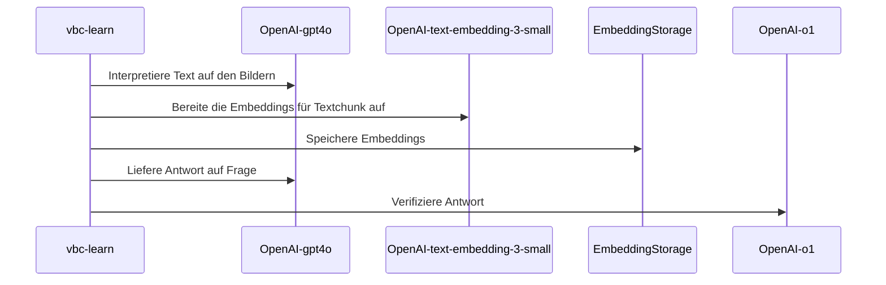

# Project01 - Vertragsbedingungen-Chat

Das Projekt vbc (Vertragsbedingns-Chat) ist im Rahmen des 1. Semesterprojekts
des CAS AI Herbst 2024 an der BFH entstanden. 

Folgende Personen der _Gruppe 3_ haben zu diesem Projekt beigetragen:

- Hans Wermelinger
- Helmut Gehrer
- Markus Näpflin
- Nils Hryciuk
- Stefano Mavilio

## Architektur

### Klassendiagramm

### Sequenzdiagramme

Grober Ablauf vbc-learn mit OpenAI-Modellen:

