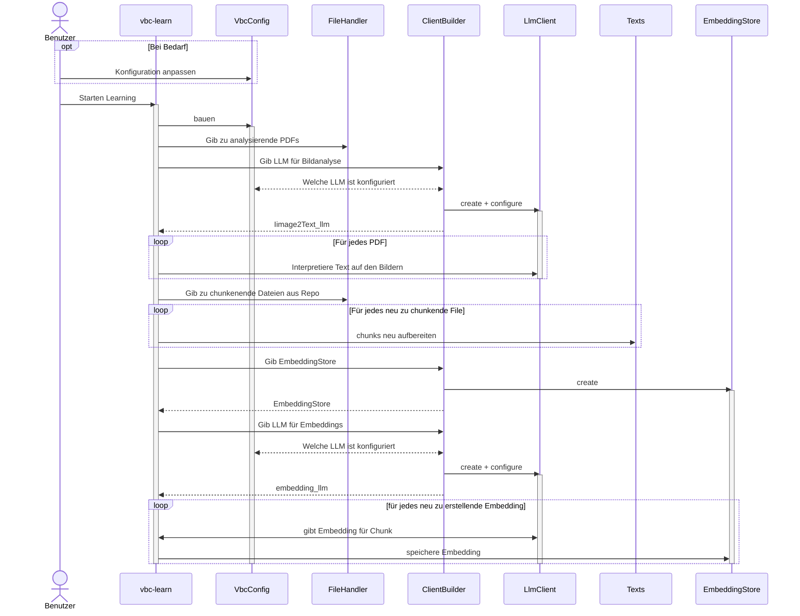
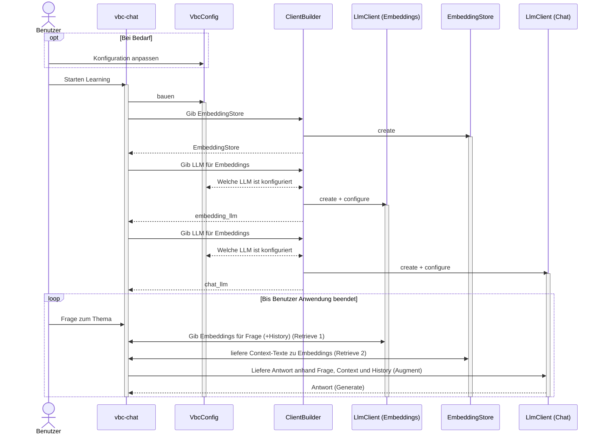

# Project01 - Vertragsbedingungen-Chat (RAG)

Das Projekt vbc (Vertragsbedingns-Chat) ist im Rahmen des 1. Semesterprojekts
des CAS AI Herbst 2024 an der BFH entstanden. 

Folgende Personen der _Gruppe 3_ haben zu diesem Projekt beigetragen:

- Hans Wermelinger
- Helmut Gehrer
- Markus Näpflin
- Nils Hryciuk
- Stefano Mavilio

##  Ausführung der Anwendung

### Vorbedingungen

- [x] Python lokal installiert
- [x] Packagemanger wie Anaconda oder venv installiert
  - [x] Sandbox (Projektumgebung) z.B. `{vbc}` erstellt
  - [ ] Projektumgebung aktiviert `conda activate {vbc}`
- [ ] Benötigte Python Module installiert
- [ ] Poppler für die Verarbeitung von PDFs installiert 
      [Installationsanweisung](https://pdf2image.readthedocs.io/en/latest/installation.html#installing-poppler)
- Für die Nutzung von OpenAI-AIs als Backend
  - [x] Openai-API-Key im [OpenAI-Dashboard](https://platform.openai.com/api-keys) gelöst
  - [ ] Api-Key steht als Umgebungsvariable OPENAI_API_KEY zur Verfügung. Dies 
    kann unter Linux/macOS mit `EXPORT OPENAI_API_KEY="sk-{der-Rest-Deines-Keys}"` 
    gewährleistet werden. Unter Windows erfolgt dies mit dem Kommando 
    `SET OPENAI_API_KEY="sk-{der-Rest-Deines-Keys}"`. Soll der Wert persistiert 
    werden, so kann unter Linux/macOS das Kommando im Init-Skript der Shell
    des Benutzers eingetragen werden. Unter Windows eignet sich hierfür entweder
    das Kommando `setx` oder der Dialog _Benutzerumgebungsvariable_ in den 
    _Systemeinstellungen_.
- Für die Nutzung von Ollama als lokales Backend
  - [x] Installation der lokale Ollama Runtime von der 
    [offiziellen Downloadseite](https://ollama.com/download) oder via 
    Package-Manager (z.B. `brew install ollama`auf macOS).
  - [ ] Installation der benötigten Modelle
      - [ ] ollama run llama3.2-vision 
      - [ ] ollama run jina/jina-embeddings-v2-base-de
      - [ ] ollama run llama3.2 
      - [ ] ollama run granite3.1-dense

- Für die Nutzung von Ollama als Docker-Backend[^1]
  - [x] Download und Run des entsprechenden Docker Images
    `docker run -d -v ollama:/root/.ollama -p 11434:11434 --name ollama ollama/ollama`
  - [ ] Setzen der Umgebungsvariablen für das Lookup der Runtime. _tbd_
  - [ ] Installation der benötigten Modelle (siehe bei "lokales Backend")
  

### Verfügbare Kommandos

- `vbc_learn` übernimmt die bereitstehenden PDFs, führt bei Bedarf deren
  Konvertierung in Texte durch, teilt diese in Chunks auf, ermittelt für diese
  die Embeddings und führt anschliessend Tests durch. Das Argument `--help` 
  zeigt die Optionen, welche beim Start mitgegeben werden können, um den Prozess
  konfigurieren.

- `vbc_chat` ist eine kleine Chat Anwendung, die das Austesten des erlernten
  Fachwissens im Dialog erlaubt.

### Konfiguration

_TBD_ siehe vorerst Datei `_configs.py`

## Architektur

### Visueller Überblick

```mermaid
architecture-beta
    group app(server)[APP]
    group cloud(cloud)[OpenAI]
    group local(server)[OLLAMA]

    service vbc_learn(CLI)[vbc_learn] in app
    service vbc_chat(CLI)[vbc_chat] in app
    service repository(disk)[Repository] in app
    service chroma_db(database)[ChromaDB] in app

    service gpt4o(internet)[gpt_4o] in cloud
    service embedding3small(internet)[text_embedding_3_small] in cloud
    service pinecone(database)[PineCone] in cloud
    service gpt4omini(internet)[gpt_4o_mini] in cloud
    service gpto1mini(internet)[gpt_o1_mini] in cloud    

    service jinaembeddings(internet)[jina_embeddings_v2_base_de] in local
    service llama32(internet)[llama3_2] in local    
    service granite31dense(internet)[granite3_1_dense] in local    

    junction cloudllm in cloud
    junction localllm in local

    vbc_learn:L -- R:cloudllm
    cloudllm:B --> T:gpt4o
    cloudllm:L --> R:embedding3small
    cloudllm:T --> B:gpt4omini
    cloudllm:L --> R:gpto1mini

    vbc_learn:B-- T:localllm
    localllm:L --> R:gpt4o
    localllm:B --> T:jinaembeddings
    localllm:B --> B:llama32
    localllm:B --> T:granite31dense    

    vbc_learn:T --> B:repository
    vbc_learn:R --> L:chroma_db

    vbc_chat:L <-- R:chroma_db
    vbc_chat:T --> T:gpt4omini
    vbc_chat:B <-- T:llama32
```

Zum Zeitpunkt der Umsetzung war das Archtitekturdiagramm noch Beta. Daher, falls GitHub diesen 
Diagrammtypen noch nicht unterstützt der [Direktlink zu Mermaid.live](https://mermaid.live/edit#pako:eNp9VNtu4jAQ_ZXITyBBlRsUrNVK0L5UYtWK5WmhskwyC24TO3Ic1G7Vf6_jEOdSWB4QM-ec4cyM7Q8UiRgQRlRGR6YgUoWE8R4U3XFHfw5SFJlDs2yQgzyBHG4XT0_PbSxKRBEPzPdw-5gBXzx08ERENLHqx9Vq8WuhCRWlTLMInNM-IglQyQd3q4fh1obPDuPlv39nR0eqGnIZXeZKyETOlJDvg5jlr8Pt2iYuC6KjFCkl8X4QU0X3NIfh9s7k7peNoqs5ZCoUA8YVSA5quNUxCYVhm8F02ZDuIY4ZPwR5SpOkpVPwpoiFSUAM4VqdjHGIBIeW0SedutOpaxJjNGWcfTNLyux_ZMK7IBNeT1aK-sN5YZzanvJWhRJous3JySdlFySu7JuD0y2VJDSlgd-qUWWI3ygqCx33knJ9tAMvBp5Du4UzQDxioH6RqsxLwSPFxLnDJEl7Q7K4UZ7xs_mKYY8zXjnjsbPGdaUKriO81OhPZ4PNlnrYymBr3Ds8PdbGsJbY7vlKFbvQ7xaX2uEG171UaB219bVDi9Xuu_u-SFri8yavlOhurL2MxmfdanPB-4y1YaywvdHtIuWLodv5Ue2jYXTwTXshzTgtvjT6Td0NGqEUZEpZrB_Uj5K7Q-oIKewQ1j9jKl93aMc_NY8WSvx-5xHCShYwQvqpPBwR_kuTXEdFpq803DOqB5HabEb5HyHSWqJDhD_QG8Lh7fQmnLjT6XTuerPAm4cj9I5w4E5uXM8P_bnrT13Pu_0coX-mgHtzOwvcIAzDYDaZ-LPJ9PMLdxsDtw)

### AI-Stacks

Wir kennen grundsätzlich 2 Stacks:

- **Cloud:** Setzt vor allem auf den APIs von OpenAI auf
- **Lokal:** Verwendet (wenn immer möglich) lokale Dienste.

Die Bestandteile der beiden Stacks sind wie folgt:

|  Aufgabe                   | Cloud                | Lokal             |
| -------------------------- | -------------------- | ----------------- |
| Konvertierung Bild zu Text | OpenAI (gpt-4o)      | OpenAI (gpt-4o) / Ollama (llama3.2-vision) |
| Erstellung Embeddings      | PineCone (multilingual-e5-large) / OpenAI (text-embedding-3-small) | Ollama (jina/jina-embeddings-v2-base-de) |
| Speicherung Embeddings     | PineCone             | Chroma |
| Chat                       | OpenAI (gpt-4o-mini) | Ollama (llama3.2) |
| Tests                      | OpenAI (o1-mini)      | granite3.1-dense |

### Verzeichnisstruktur

- :open_file_folder: `BFH_CAS_AI_2024/Project01/Grp3`
  - :file_folder: `input` Enthält alle zu verarbeitenden Dateien. 
    Unterstützt wird im Moment *.pdf 
  - :file_folder: `logs` Enthält die lokalen Logdateien.
  - :file_folder: `models` Enthält lokale Modelle.
    Dies können z.B. die CSV Dateien der lokalen Embeddings sein.
  - :file_folder: `work` Enthält Metainforamtionen des vorhandenen Fachwissens. 
    Pro verarbeitet Datei im Verzeichnis `input` ist hier eine Datei vorhanden,
    die den Stand der Verarbeitung und Zwischenergebnisse festhält.

### Sequenzdiagramme

#### Lernprozess (Ingest)

Grober Ablauf vbc-learn mit OpenAI-Modellen:

#### Chat (Retrieve - Augment - Generate)

### Klassendiagramm

```mermaid
---
title: vbc (Vertragsbedingungs-Chat)
---
classDiagram
class VbcLearn
class VbcChat
namespace _builders {
    class ConfigBuilder {
        +with_image_to_text_config()  -> ConfigBuilder
        +with_embeddings_config()  -> ConfigBuilder
        +with_answer_with_hits_config() -> ConfigBuilder
        +build() -> LlmClientConfig
    }
    class ClientBuilder{
        +for_image_to_text() -> ClientBuilder
        +for_embeddings() -> ClientBuilder
        +for_response() -> ClientBuilder
        +build() -> LlmClient
    }   
    class EmbeddingStoreBuilder{
        +build() -> EmbeddingStore
    }
}
namespace _apis {
    class LlmClient {
        +get_text_from_image(base64_encoded_image) -> str
        +get_embeddings(text_to_embed) -> str
        +get_response(question, embeddings) -> str
        +answer_with_hints(question, hints, chat_thread):  -> str
        +test_statement(question, expected_answer) -> bool
        +text_from_image_config() -> LlmClientConfig
        +embeddings_config() -> LlmClientConfig
        +answer_with_hints_config() -> LlmClientConfig
    }
    class LlmClientConfigurator {
        +textcontent_from_image_config() -> LlmClientConfig
        +embeddings_config() -> LlmClientConfig
        +answer_with_hits_config() -> LlmClientConfig
        +test_config() -> LlmClientConfig
    }
    class EmbeddingStore {
        +is_full_reload_required()
        +delete_all()
        +find_most_similar(, embeddings, top_k=1)
        +store(text, embeddings)
        +close()
    }
}
namespace _configs {
    class SupportedLlmProvider {     
        <<enumeration>>
        OPENAI
        HUGGINGFACE 
        OLLAMA 
    }
    class ChunkingMode {
        <<enumeration>>
        DOCUMENT
        PAGE 
        SECTION 
        PARAGRAPH 
        SENTENCE 
    }   
    class EmbeddingStorage{
        <<enumeration>>
        CSV
        PINECONE 
        CHROMA 
    }
    class VbcAction {
        <<enumeration>>
        INCREMENTAL_REINDEXING 
        FULL_REINDEXING 
        CHAT 
    }
    class LlmClientConfig {
        model_id: str 
        max_tokens: Optional[int] 
        temperature: Optional[float] 
        top_p: Optional[float] 
        system_prompt: Optional[str] 
        user_prompt: Optional[str] 
    }
    class VbcConfig {
        action: VbcAction 
        sources_path: str 
        model_path: str
        knowledge_repository_path: str 
        language: str
        learn_version 
        chunking_mode: ChunkingMode 
        image2text_llm_provider: SupportedLlmProvider 
        embeddings_provider: SupportedLlmProvider
        embeddings_storage: EmbeddingStorage 
        chat_llm_provider: SupportedLlmProvider
        +with_image_to_text_config(image_to_text_config: LlmClientConfig)
        +with_embeddings_config(embeddings_config: LlmClientConfig)
        +with_answer_with_hints_config(answer_with_hits_config: LlmClientConfig)
        +as_profile_label()
        +from_profile_label(mode)
    }
}
namespace _file_io {
    class InputFile {
        +is_processable_as_image():
        +get_content():
    }
    class MetaFile {
        +save(self):
        +add_page(page):
        +get_pages() -> list[str]:
        +add_chunk(, chunk):
        +remove_chunks():
        +get_chunks() -> list[str]:
    }
    class InputFileHandler {
        +get_all_input_files() -> list[InputFile]:
        +get_input_files_to_process(config: VbcConfig) -> list[InputFile]:
        +delete_all_metafiles():
        +get_all_metafiles() -> list[MetaFile]:
        +get_metafiles_to_chunk(config: VbcConfig) -> list[MetaFile]:
        +get_metafiles_to_embed(config: VbcConfig) -> list[MetaFile]:
    }
}
namespace _openai_client {
    class OpenAiClient
}
namespace _openai_config {
    class OpenAiClientConfigurator
}
namespace _ollama_client {
    class OllamaClient
}
namespace _openai_config {
    class OllamaClientConfigurator
}
namespace _csv_embedding {
    class CsvEmbeddingStore
}
namespace _chroma_embedding {
    class ChromaEmbeddingStore
}
namespace _pineconde {
    class PineConeEmbeddings
}

ConfigBuilder --* VbcConfig: creates
ConfigBuilder --* LlmClientConfig: creates
VbcConfig o-- LlmClientConfig: consists of
VbcConfig -- SupportedLlmProvider : categorizes
VbcConfig -- ChunkingMode : categorizes
VbcConfig -- EmbeddingStorage : categorizes
VbcConfig -- VbcAction : categorizes

LlmClientConfigurator <|-- OpenAiClientConfigurator : implements
LlmClientConfigurator <|-- OllamaClientConfigurator : implements

ClientBuilder --* LlmClient
LlmClient <|-- OpenAiClient : implements
LlmClient <|-- OllamaClient : implements
LlmClient <|-- PineConeEmbeddings

EmbeddingStoreBuilder --* EmbeddingStore
EmbeddingStore <|-- PineConeEmbeddings
EmbeddingStore <|-- CsvEmbeddingStore
EmbeddingStore <|-- ChromaEmbeddingStore

InputFileHandler --* InputFile
InputFileHandler --* MetaFile

VbcLearn -- ConfigBuilder : uses
VbcLearn -- ClientBuilder : uses
VbcLearn -- InputFileHandler: uses
VbcLearn -- EmbeddingStoreBuilder: uses

VbcChat -- ConfigBuilder : uses
VbcChat -- ClientBuilder : uses
VbcChat -- EmbeddingStoreBuilder : uses
```

## Lokales RAG mit Ollama

Im Rahmen der Projektarbeit haben wir versucht RAG lokal ohne Internetanbindung für den 
Verarbeitungsprozess zu realisieren.

Als lokale Laufzeit kam dabei Ollama zum Zug. Folgende Modelle wurden in die Evaluation mit 
einbezogen:

| Modell | Einsatz für | Findings | Geeignet |
| ------ | ----------- | -------- | -------- |
| llama3.2-vision | Bild-zu Text-Konvertierung | Schafft es nur vereinzelt, Bilder zu Texten aufzubereiten, bleibt oft hängen oder fängt an zu halluzinieren | :thumbsdown: | 
| llama3.2 | Chat / RAG | | :thumbsup: | 
| llama3.3 | Reasoning | Benötigt zu viel Memory für unser Test-Setup | :thumbsdown: | 
| qwq | - | Benötigt zu viel Memory für unser Test-Setup | :thumbsdown: | 
| mistral | | Sprachenunterstütung (de) ungenügend | :thumbsdown: |
| jina/jina-embeddings-v2-base-de | Embeddings erstellen |  | :thumbsup: |
| granite3.1-dense | Chat / RAG / Testing | Relativ neues Modell von IBM | :thumbsup: | 

[^1]: Je nach Umgebung wird im Moment noch die native Installation empfohlen, da für die 
      Unterstützung der Grafik-Karte im Docker-Image noch einige manuelle Eingriffe nötig sind. Für 
      weitere Details siehe
  - [Ankündigung](https://ollama.com/blog/ollama-is-now-available-as-an-official-docker-image)
  - [Image Dokumentation](https://hub.docker.com/r/ollama/ollama)

## Ratenbegrenzung

Ein LLM ist rechen- und daher auch kostenintensiv. Aus diesem Grund ist es sinnvoll, Begrenzungen einzubauen. 
Das ist besonders wichtig, wenn auf externe LLM-Services wie ChatGPT zugegriffen wird.

- **Token pro Minute**: Begrenzung der Anzahl an Token pro Minute, um Ressourcen zu schonen und Überlastung zu vermeiden.
- **Anfragen pro Tag**: Begrenzung der Gesamtanfragen pro Tag, um Missbrauch über längere Zeiträume zu verhindern.
- **Anfragen pro Minute (RPM)**: Begrenzung der Anfragen pro Minute, um plötzliche Lastspitzen zu verhindern und die Reaktionsfähigkeit zu erhalten.

## Sicherheit

- **Kontext**: Ein leistungsstarkes LLM verfügt über umfangreiche Daten, jedoch soll die RAG-App nur die Daten berücksichtigen, die bereitgestellt wurden. Deshalb muss im Prompt eine Einschränkung eingebaut werden.
- **Rollen**: Mit Rollen können Daten geschützt werden, sodass nur Berechtigte sie verwenden können. Dafür gibt es unterschiedliche Lösungen wie Indizes, Metadaten oder Namespaces.

### Prompt Injection

Benutzer erfassen Daten und interagieren somit mit dem LLM. Dadurch existiert die Gefahr von **Prompt Injection**. Der User kann so den Prompt übersteuern.

- **Input- und Kontext-Validierung**: Input- und Kontextvalidierung stellen sicher, dass Benutzereingaben und der Kontext der Anfrage korrekt und sicher sind, um unerwünschte Manipulationen oder Missbrauch zu verhindern.
- **Vorlagen**: In Prompts kann alles enthalten sein. Daher ist es empfehlenswert, möglichst bewährte Prompt-Vorlagen zu verwenden.
- **Tool**: Es gibt laufend neue Angriffe, daher lohnt es sich, auf bewährte Bibliotheken zu setzen, wie zum Beispiel [promptmap](https://github.com/utkusen/promptmap) oder LLMs wie [deberta-v3-base-prompt-injection-v2](https://huggingface.co/protectai/deberta-v3-base-prompt-injection-v2) auf Hugging Face.

## Testing

Für das RAG-System werden Integrationstests und End-to-End-Tests (E2E) programmiert, um die Funktionsweise
sicherzustellen. Unit-Tests entfallen vorerst. Zu jedem Test gibt es zusätzlich eine Variante mit Tippfehlern, um die
Robustheit bei fehlerhaften Eingaben zu prüfen.

### Retrieval

* **Similarity**: Die erwarteten Texte aus der Pinecone-Datenbank werden geladen.
* **Performance**: Die Geschwindigkeit, mit der die Daten geladen werden, um potenzielle Lecks zu finden.

### Generation

* **Semantic**: Der generierte Text muss eine hohe Cosine Similarity mit einem erwarteten Text aufweisen.
* **Words Overlapping**: Der Text muss bestimmte Fachbegriffe beinhalten.
* **Fallback**: Sofern keine Antwort geliefert werden kann, muss ein Fallback-Text angezeigt werden.
