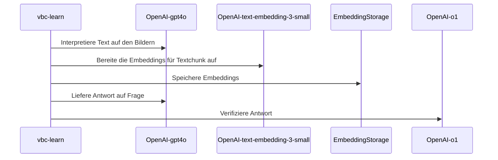

# Project01 - Vertragsbedingungen-Chat (RAG)

Das Projekt vbc (Vertragsbedingns-Chat) ist im Rahmen des 1. Semesterprojekts
des CAS AI Herbst 2024 an der BFH entstanden. 

Folgende Personen der _Gruppe 3_ haben zu diesem Projekt beigetragen:

- Hans Wermelinger
- Helmut Gehrer
- Markus Näpflin
- Nils Hryciuk
- Stefano Mavilio

##  Ausführung der Anwendung

### Vorbedingungen

- [x] Python lokal installiert
- [x] Packagemanger wie conda oder venv installiert
  - [x] Sandbox (Projektumgebung) z.B. `{vbc}` erstellt
  - [ ] Projektumgebung aktiviert `conda activate {vbc}`
- [ ] Benötigte Python Module installiert
- [ ] Poppler für die Verarbeitung von PDFs installiert 
      [Installationsanweisung](https://pdf2image.readthedocs.io/en/latest/installation.html#installing-poppler)
- Für die Nutzung von OpenAI-AIs als Backend
  - [x] Openai-API-Key im [OpenAI-Dashboard](https://platform.openai.com/api-keys) gelöst
  - [ ] Api-Key steht als Umgebungsvariable OPENAI_API_KEY zur Verfügung. Dies 
    kann unter Linux/macOS mit `EXPORT OPENAI_API_KEY="sk-{der-Rest-Deines-Keys}"` 
    gewährleistet werden. Unter Windows erfolgt dies mit dem Kommando 
    `SET OPENAI_API_KEY="sk-{der-Rest-Deines-Keys}"`. Soll der Wert persistiert 
    werden, so kann unter Linux/macOS das Kommando im Init-Skript der Shell
    des Benutzers eingetragen werden. Unter Windows eignet sich hierfür entweder
    das Kommando `setx` oder der Dialog _Benutzerumgebungsvariable_ in den 
    _Systemeinstellungen_.
- Für die Nutzung von Ollama als lokales Backend
  - _TBD_

- Für die Nutzung von Ollama als Docker-Backend
  - _TBD_

### Verfügbare Kommandos

- `vbc_learn` übernimmt die bereitstehenden PDFs, führt bei Bedarf deren
  Konvertierung in Texte durch, teilt diese in Chunks auf, ermittelt für diese
  die Embeddings und führt anschliessend Tests durch. Das Argument `--help` 
  zeigt die Optionen, welche beim Start mitgegeben werden können, um den Prozess
  konfigurieren.

- `vbc_chat` ist eine kleine Chat Anwendung, die das Austesten des erlernten
  Fachwissens im Dialog erlaubt.

### Konfiguration

_TBD_ siehe vorerst Datei `_congigs.py`

## Architektur

### Verzeichnisstruktur

- :open_file_folder: `BFH_CAS_AI_2024/Project01/Grp3`
  - :file_folder: `input` Enthält alle zu verarbeitenden Dateien. 
    Unterstützt wird im Moment *.pdf 
  - :file_folder: `logs` Enthält die lokalen Logdateien.
  - :file_folder: `models` Enthält lokale Modelle.
    Dies können z.B. die CSV Dateien der lokalen Embeddings sein.
  - :file_folder: `work` Enthält Metainforamtionen des vorhandenen Fachwissens. 
    Pro verarbeitet Datei im Verzeichnis `input` ist hier eine Datei vorhanden,
    die den Stand der Verarbeitung und Zwischenergebnisse festhält.

### Klassendiagramm

### Sequenzdiagramme

Grober Ablauf vbc-learn mit OpenAI-Modellen:

