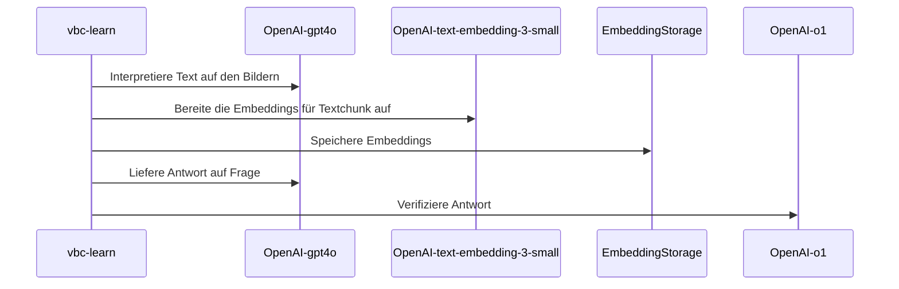

# Project01 - Vertragsbedingungen-Chat (RAG)

Das Projekt vbc (Vertragsbedingns-Chat) ist im Rahmen des 1. Semesterprojekts
des CAS AI Herbst 2024 an der BFH entstanden. 

Folgende Personen der _Gruppe 3_ haben zu diesem Projekt beigetragen:

- Hans Wermelinger
- Helmut Gehrer
- Markus Näpflin
- Nils Hryciuk
- Stefano Mavilio

##  Ausführung der Anwendung

### Vorbedingungen

- [x] Python lokal installiert
- [x] Packagemanger wie Anaconda oder venv installiert
  - [x] Sandbox (Projektumgebung) z.B. `{vbc}` erstellt
  - [ ] Projektumgebung aktiviert `conda activate {vbc}`
- [ ] Benötigte Python Module installiert
- [ ] Poppler für die Verarbeitung von PDFs installiert 
      [Installationsanweisung](https://pdf2image.readthedocs.io/en/latest/installation.html#installing-poppler)
- Für die Nutzung von OpenAI-AIs als Backend
  - [x] Openai-API-Key im [OpenAI-Dashboard](https://platform.openai.com/api-keys) gelöst
  - [ ] Api-Key steht als Umgebungsvariable OPENAI_API_KEY zur Verfügung. Dies 
    kann unter Linux/macOS mit `EXPORT OPENAI_API_KEY="sk-{der-Rest-Deines-Keys}"` 
    gewährleistet werden. Unter Windows erfolgt dies mit dem Kommando 
    `SET OPENAI_API_KEY="sk-{der-Rest-Deines-Keys}"`. Soll der Wert persistiert 
    werden, so kann unter Linux/macOS das Kommando im Init-Skript der Shell
    des Benutzers eingetragen werden. Unter Windows eignet sich hierfür entweder
    das Kommando `setx` oder der Dialog _Benutzerumgebungsvariable_ in den 
    _Systemeinstellungen_.
- Für die Nutzung von Ollama als lokales Backend
  - [x] Installation der lokale Ollama Runtime von der 
    [offiziellen Downloadseite](https://ollama.com/download) oder via 
    Package-Manager (z.B. `brew install ollama`auf macOS).
  - [ ] Installation der benötigten Modelle
      - [ ] ollama run llama3.3 --> benötigt zu viel Memory
      - [ ] ollama run qwq https://ollama.com/library/qwq
      - [ ] ollama run llama3.2 
      - [ ] ollama run llama3.2-vision 
      - [ ] ollama run mistral --> nur englisch

- Für die Nutzung von Ollama als Docker-Backend[^1]
  - [x] Download und Run des entsprechenden Docker Images
    `docker run -d -v ollama:/root/.ollama -p 11434:11434 --name ollama ollama/ollama`
  - [ ] Setzen der Umgebungsvariablen für das Lookup der Runtime. _tbd_
  - [ ] Installation der benötigten Modelle (siehe bei "lokales Backend")
  

### Verfügbare Kommandos

- `vbc_learn` übernimmt die bereitstehenden PDFs, führt bei Bedarf deren
  Konvertierung in Texte durch, teilt diese in Chunks auf, ermittelt für diese
  die Embeddings und führt anschliessend Tests durch. Das Argument `--help` 
  zeigt die Optionen, welche beim Start mitgegeben werden können, um den Prozess
  konfigurieren.

- `vbc_chat` ist eine kleine Chat Anwendung, die das Austesten des erlernten
  Fachwissens im Dialog erlaubt.

### Konfiguration

_TBD_ siehe vorerst Datei `_configs.py`

## Architektur

### Verzeichnisstruktur

- :open_file_folder: `BFH_CAS_AI_2024/Project01/Grp3`
  - :file_folder: `input` Enthält alle zu verarbeitenden Dateien. 
    Unterstützt wird im Moment *.pdf 
  - :file_folder: `logs` Enthält die lokalen Logdateien.
  - :file_folder: `models` Enthält lokale Modelle.
    Dies können z.B. die CSV Dateien der lokalen Embeddings sein.
  - :file_folder: `work` Enthält Metainforamtionen des vorhandenen Fachwissens. 
    Pro verarbeitet Datei im Verzeichnis `input` ist hier eine Datei vorhanden,
    die den Stand der Verarbeitung und Zwischenergebnisse festhält.

### Klassendiagramm

### Sequenzdiagramme

Grober Ablauf vbc-learn mit OpenAI-Modellen:

## Lokales RAG mit Ollama

Im Rahmen der Projektarbeit haben wir versucht RAG lokal ohne Internetanbindung für den 
Verarbeitungsprozess zu realisieren.

Als lokale Laufzeit kam dabei Ollama zum Zug. Folgende Modelle wurden in die Evaluation mit 
einbezogen:

| Modell | Einsatz für | Findings | Geeignet |
| ------ | ----------- | -------- | -------- |
| llama3.2-vision | Bild-zu Text-Konvertierung | | (/) | 
| llama3.2 | Chat / RAG | | (/) | 
| llama3.3 | Reasoning | Benötigt zu viel Memory für unser Test-Setup | (-) | 
| qwq | - | Benötigt zu viel Memory für unser Test-Setup |  | 
| mistral | | Sprachenunterstütung (de) ungenügend) | (-) |

[^1]: Je nach Umgebung wird im Moment noch dienative  Installation empfohlen, da 
  für die Unterstützung der Grafik-Karte im Docker-Image noch einige manuelle 
  Eingriffe nötig sind. Für weitere Details siehe
  - [Ankündigung](https://ollama.com/blog/ollama-is-now-available-as-an-official-docker-image)
  - [Image Dokumentation](https://hub.docker.com/r/ollama/ollama)